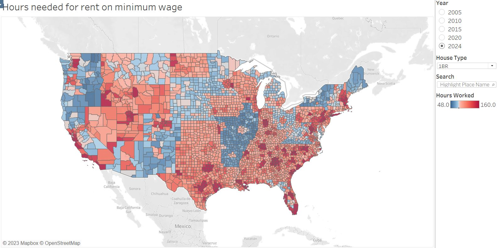

# Vizualizing the affordability of housing in the US over time

## Summary
[LINK](https://public.tableau.com/shared/BP4F3YTGK?:display_count=n&:origin=viz_share_link)
### The Map
An interactive map to visualize how many hours one person would need to work on minimum wage in order to afford different kinds of housing over time. The user can choose different combinations of years and housing types (studio, 1BR, 2BR, etc) and see how the value of the minimum wage has changed over time when it comes to housing. The colors on the map represent hours worked in order to afford a home in the 40th percentile of price in that county. 

Minimum wages are by county, however some cities do have minimum wage ordinances which may make the data innacurate in some areas (this is an area to improve on.)

A popular rule of thumb is that your rent should be about 30% of your pre-tax income. Given a standard month with 160 hours of work being completed, this implies that about 48 working hours should be dedicated to paying rent. Therefore, counties where you could pay rent with 48 hours of work or less are marked with dark blue.

The neutral grey color represents working 80 hours to pay rent. Counties where you would need to work 160+ hours are the darkest red.

## Technology / skills used
- Excel
- Tableau
- Python/Pandas and a tiny bit of SQL
- Researching and finding data
- Data cleaning/organization/compilation
- Data analysis and visualization

## About the data used
### Notes
Minimum wage is a complicated subject because many states have complicated laws regarding it. For example in a given state minimum wage for a given job may depend on whether the job provides health insurance, the profits of the employer, the number of employees, etc. Certain towns and counties may also impose their own separate minimum wages.

Minimum wage for tipped employees was disregarded. This is for hourly employees.

During my data gathering, for any given county I used the lowest legal wage that someone might earn. For example, if in one state minimum wage is 9 dollars if insurance is provided, and 10 if not, I would go with 9. 

### Data
#### Minimum Wage
- **State-level**: Department of Labor minimum wage history: https://www.dol.gov/agencies/whd/state/minimum-wage/history
- **Individual Counties**: I couldn't find a comprehensive list of counties with their own minimum wage laws, but I was able to find many through my research and included them. 
#### Housing Costs
- US HUD fair market rents (40th percentile): https://www.huduser.gov/portal/datasets/fmr.html?aid=03c3fad7-bea6-4ab9-9a7a-82f4d6380c42

## Future Work
In the future, I would like to.. 
- Find a way to incorporate city ordinances into the analysis. At the moment, all the data is scattered around different state government sites and it would take forever to gather exceptions for different counties (I'll do it if somebody pays me.) 
- lengthen the timespan available.
- Find a good source for median wage by county and let users toggle for this. I think it is a better indicator for general quality of life.

## Steps in detail
1. Get the rental price data, by county, for each year. Compile this into a single file, which was annoying because the HUD seems to use different variable names each year.
2. Use Pandas to do a SQL GROUP BY on this data to average out duplicate counties in the data. There are duplicate counties because some states collect data in more detail than just the county level and therefore have more than one row for each county.
3. Get the minimum wage data for each year and each state. Write an Excel script to assign the proper minimum wage to each county in each year in the rental data file.
4. Calculate the hours needed to work on this minimum wage with an easy excel equation.
5. Visualize on Tableau.
